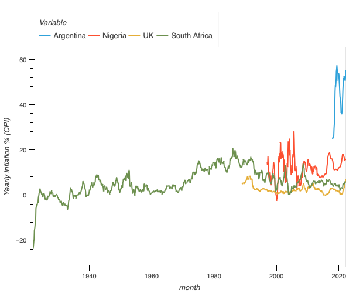

# Better national statistics data publishing

## Comparing inflation across countries

This is a graph of inflation over time in Argentina, Ireland, Nigeria, the UK and South Africa. It's also online as [an interactive plot](https://rawcdn.githack.com/FullFact/nso-stats-fetcher/06f2db0c587532934750024118cd1170e8b395d8/data/inflation_stats.html). It shows the monthly consumer price index, year-on-year. 



What's really obvious here is the big difference in information about inflation between the different countries. South Africa's stretches all the way back to the 1920s while data on Argentina only starts in the late 2010s.     

This is a sign that something is going on with the data sources. They're not standardised or the making and publishing of these statistics differs a lot. 

And indeed, making this graph was not at all simple. It took a lot of time, plenty of searching and some programming skills to create. 

This shouldn't be the case. These are very important national statistics data, and they should be be easy for anyone find, view and analyse. 

In this piece, I'll show the differences in how this information was published. And then say how it can be published better. 

## Why are you doing this?

Two reasons, really.

Full Fact are developing a robo-checking tool, which automates parts of fact checking. To say whether a claim or true or not, it needs a standardised, reliable dataset. One of the topics it is used on is inflation. So, we created code which fetches and standardises this data and puts it all in [one location within a Github repo](https://github.com/FullFact/nso-stats-fetcher/tree/main/data).

More broadly, at the Open Data Institute, we want a world where data works for everyone. National statistics are really important open data. And we hope with better-published national statistics, it means more people using them to for more insights and better decisions. We hope this article helps the cause!

## What are national statistics

There are many organisations in a country that can publish national statistics data. These include government departments, research institutes, health services, survey companies or international groups. All the statistics published by these creates the [**national statistical system**](https://stats.oecd.org/glossary/detail.asp?ID=1726).

One organisation usually operates as the main hub for national statistical data in a country. These are known as [National Statistical Offices](https://stats.oecd.org/glossary/detail.asp?ID=4344) (NSOs).

NSOs publish statistical data on topics like health, the economy, education and housing. People in the public and private sectors use this data to observe what is happening in the country and to plan ahead. There are NSOs in almost every country on earth. Nearly every country has one main NSO, but in some, such as the USA, the job is split across multiple organisations.

## A brief note on inflation

There's other places much [more qualified than here to define inflation](https://www.oecd-ilibrary.org/economics/producer-price-indices-ppi/indicator/english_a24f6fa9-en). But, in short, there are a few types. Consumer Price Index, CPI, is the weighted average of a typical basket of goods. CPIH is another, used by the UK's ONS, which includes housing. There's Producer Price Index, which measures how much domestic producers pay. And there's also Retail Price Index which measures retail goods and services.

When you see "inflation" in the news, they're usually talking about CPI. And therefore, this is most important for fact checking.  So we focus on how we got the CPI for each country. 

We should mention, we are not judging how these inflation measures are calculated or which country's measure is the best. We're focused on how these numbers appear on NSO websites, and are they easy to access and use. 

## Getting the inflation data for each country

These are some points about collecting the data from each country. The details might be a bit dry, but the main thing is just how varied, challenging and often needing special insider knowledge it is to get, what should, headline data from these NSOs. 

### Argentina

- [Instituto Nacional de Estadística y Censos](https://www.indec.gob.ar) (INDEC), is the country's main NSO. It has [different pages](https://www.indec.gob.ar/indec/web/Nivel4-Tema-3-5-31) with [reports](https://www.indec.gob.ar/uploads/informesdeprensa/ipc_05_2224DC1A5434.pdf) and some [datasets](https://www.indec.gob.ar/ftp/cuadros/economia/sh_ipc_aperturas.xls) (.XLS file) related to inflation (or "*Índice de precios al consumidor*" as is the translation of "consumer price index"). 
- This was quite a difficult page for me to find though. A large part of this is definitely my lack of Spanish skills. I tried using an in-browser translation service but couldn't find exactly what I wanted. Then I asked two Spanish-speaking people in the ODI to help me out, but neither could find the CPI numbers. 
- Luckily, on this project we have Chequeado as partners. So I have quite a long message thread on Slack with Ignacio Ferreiro and Francisco Pensa who helped me ifnd the page for monthly year-on-year CPI on its [own dedicated page](https://datos.gob.ar/series/api/series/?ids=148.3_INIVELNAL_DICI_M_26&collapse=month&collapse_aggregation=avg&representation_mode=percent_change_a_year_ago). 
- And the data was available in CSV and JSON. Fantastic! However, there was one slight odd thing whether it showed the rate as percentages on the graph but the data is in ratios between 0 and 1. 
- Overall, the data is well-formed, and very easy to work with. However, it's not ideal that I needed to find experienced users of these national statistics to find where this data is stored.  

### Ireland
- [Central Statistics Office](https://www.cso.ie/en/index.html) Ireland
- Not too hard to find although took a little bit of playing around with their portal [PxStat](https://github.com/CSOIreland/PxStat) to get the needed CPI data. 
- Homepage -> [Consumer Price Index](https://www.cso.ie/en/releasesandpublications/er/cpi/consumerpriceindexapril2022/) -> [Consumer Price Index Monthly Series](https://data.cso.ie/product/CPIM) -> [CPM01 - Consumer Price Index](https://data.cso.ie/table/CPM01) 
- The table has multiple fields and CPI rates for individual commodities (clothing, alcohol, transport, etc). So to simplify this I selected "Percentage Change over 12 months (%)" and a Commodity Group of "all item"
- The website's portal impressively also presents [the API query for this exact information](https://ws.cso.ie/public/api.jsonrpc?data=%7B%22jsonrpc%22:%222.0%22,%22method%22:%22PxStat.Data.Cube_API.ReadDataset%22,%22params%22:%7B%22class%22:%22query%22,%22id%22:%5B%22STATISTIC%22,%22C01779V03424%22%5D,%22dimension%22:%7B%22STATISTIC%22:%7B%22category%22:%7B%22index%22:%5B%22CPM01C07%22%5D%7D%7D,%22C01779V03424%22:%7B%22category%22:%7B%22index%22:%5B%22-%22%5D%7D%7D%7D,%22extension%22:%7B%22pivot%22:null,%22codes%22:false,%22language%22:%7B%22code%22:%22en%22%7D,%22format%22:%7B%22type%22:%22JSON-stat%22,%22version%22:%222.0%22%7D,%22matrix%22:%22CPM01%22%7D,%22version%22:%222.0%22%7D%7D). 

### Japan
- [Statistics Bureau of Japan](https://www.stat.go.jp/english/)
- [Consumer Price Index](https://www.stat.go.jp/english/data/cpi/1581-z.html) under "Latest Indicators" section on main page. Then [Link to statistical tables & database](https://www.e-stat.go.jp/en/stat-search/files?page=1&layout=datalist&toukei=00200573&tstat=000001150147&cycle=1&tclass1=000001150149&tclass2val=0). Then [April 2022](https://www.e-stat.go.jp/en/stat-search/files?page=1&layout=datalist&toukei=00200573&tstat=000001150147&cycle=1&year=20220&month=12040604&tclass1=000001150149&result_back=1&tclass2val=0). Then under [Table number 1-1 – Subgroup Index for Japan - Monthly](https://www.e-stat.go.jp/en/stat-search/files?page=1&layout=datalist&toukei=00200573&tstat=000001150147&cycle=1&year=20220&month=12040604&tclass1=000001150149&stat_infid=000032197259&result_back=1&tclass2val=0). Then download the Excel file. 
- There's the option of downloading a CSV file, but it doesn't seem to be available to get it month-by-month for years back.
- Also an API but that seems to need an API key. 

### Nigeria
* [Nigeria Bureau of Statistics](https://nigerianstat.gov.ng)
* The hompage has graphs of CPI but no link to the underlying datasets
* Maybe not the clearest structure but easy enough to find the table. [E-library](https://nigerianstat.gov.ng/elibrary) -> [CPI and Inflation Report April 2022](https://nigerianstat.gov.ng/elibrary/read/1241170) -> [Download Tables](https://nigerianstat.gov.ng/resource/cpi_1NewAPR2022.xlsx) (Excel file). 
* However, the format of the table though was quite tricky to parse programatically. The year isn't filled in for each month so have to interpret it based on last entered year. Month names also switch from shortened 3-letter to full names. 

### Philippines
* [Philippines Statistics Authority](https://psa.gov.ph)
* Scroll down and there's a list of images of headline statistics. Click on "prices" to get to the [Summary Inflation Report Consumer Price Index](https://psa.gov.ph/statistics/survey/price/summary-inflation-report-consumer-price-index-2018100-may-2022)
* On this page, there's an image which is a [screenshot of a spreadsheet table](https://psa.gov.ph/sites/default/files/psd/CPI%20%282018%3D100%29_05_2022_F2_0.gif) with a recent history of monthly CPI rates. 
* However, at the bottom, the "Statistical Tables on CPI for All Income Households for May 2022" Excel file does not contain this table. I couldn't find this table in any other file. Does it exist online?
* So I copied each value of this table directly in to a script which generates the table.  

### South Africa
- [Statistics South Africa](https://www.statssa.gov.za) is the NSO for South Africa. 
- Finding monthly CPI involved navigating through: Find Statistics -> [By theme](https://www.statssa.gov.za/?page_id=595) -> The economy -> [Inflation](https://www.statssa.gov.za/?page_id=735&id=3) -> Consumer Price Index. 
- On that page there's a standard report in PDF with the supporting tables also available to download. 
- The actual table we want is in the [CPI History document](http://www.statssa.gov.za/publications/P0141/CPIHistory.pdf) in a PDF format. 
- This PDF makes it much harder to read using a programme, unlike the JSON files from Argentina and UK. 
- However, it goes back nearly 100 years!

### United Kingdom
* The ONS make it extremely easy to find inflation data. The link to [CPIH (housing included) data](https://www.ons.gov.uk/economy/inflationandpriceindices/timeseries/l55o/mm23) is right there clearly marked on the homepage.  
* However, we're looking for just the regular Consumer Price Index data. The search didn't show exactly what we needed. 
* So I just relied on Full Fact to point me to where the [dataset for CPI history is](https://www.ons.gov.uk/economy/inflationandpriceindices/timeseries/d7g7/mm23). I'm still not sure how you directly navigate to it. 
* ALSO, I learned from Full Fact the one magical trick where if you type `/data` on an ONS dataset page, it'll show it in JSON! Mind blown. I'm not entirely sure if this is documented anywhere but it's extremely useful.  

### Countries I couldn't find the data for

#### India
- Government of India – [Ministry of Statistics and Programme Implementation](https://mospi.gov.in/web/mospi/home)
- Go to [Download tables/data](https://mospi.gov.in/web/mospi/download-tables-data) -> [CPI](https://mospi.gov.in/web/mospi/download-tables-data/-/reports/view/templateOne/16401?q=TBDCAT) -> [April 2022](https://mospi.gov.in/documents/213904//536525//1652358207416_State-wise%20group%20indices%20April%202022.pdf//cbf43606-3aa0-c050-e7c2-e276f6663d87)
- While this is broken down by region and product, doesn't have history of national CPI.  
- There's a new [national integrated information platform](https://mospi.gov.in/web/niip/home), and a [CPI page](https://mospi.gov.in/web/cpi) but no links to tables.  

#### Indonesia
- [Statistics Indonesia](https://www.bps.go.id)
- Side bar on the home page has "Economic and Trade" section. And a link to [Consumer Price Indices](https://www.bps.go.id/subject/3/inflasi.html#subjekViewTab3) which just seems to be a dead link. 

#### Pakistan
- [Pakistan Bureau of Statistics](https://www.pbs.gov.pk)
- [Price statistics](https://www.pbs.gov.pk/content/price-statistics) in the lefthand menu. 
- There's a page on [Officially Published Consumer Prices Data on IMF Template](https://www.pbs.gov.pk/content/officially-published-consumer-prices-data-imf-template) - which has the info we need but no link to underlying data.

## Improving national statistics publishing
This shouldn’t be as difficult to do this. Not that each individual site is particularly bad. It’s just that adding them up and combining them takes a lot of work of understanding the individual knowledge of each NSO.  

All NSOs publish statistical data about their country. But the quantity and quality of data varies greatly between them. This is very understandable as every country has different finances, resources and society.

However, there exist good practices and standards in open data publishing that every NSO, no matter the size of budget, can aim to achieve. We’re not saying every NSO needs to build large data platforms, but simple, achievable techniques exist which can really help users of data.

Open principles for data publishing are partly about following open standards and partly about thinking about how the data can best be designed for other people to be able to reuse.

The Office of National Statistics in the UK produced a [set of principles for what this can practically mean](https://digitalblog.ons.gov.uk/2017/01/06/some-open-data-publishing-principles/). In these they outline a need to consider publishing information so that it performs well on other sites and services. This is similar in many ways to the use of the [Claim Review format](https://schema.org/ClaimReview) in the fact checking world. For statistics this might be about how well it displays in the [Google dataset explorer](https://www.google.com/publicdata/directory) or in search results. This wider theme of making data part of the web is a key component of making data available in ways that support the processes of fact checking. By making access easier to the data, always presenting it in context and designing systems with reuse at the core.

