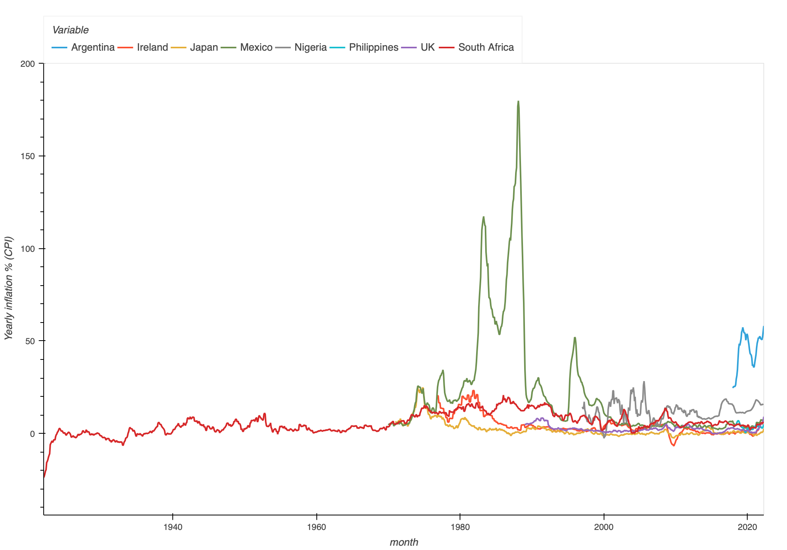

# Better national statistics data publishing

## Comparing inflation across countries

This is a graph of inflation over time in Argentina, Nigeria, the UK and South Africa (also online as [an interactive plot](https://rawcdn.githack.com/FullFact/nso-stats-fetcher/35d695071faf97930960102da860cf83e73f1c5e/data/inflation_stats.html)). It shows the monthly consumer price index, year-on-year. Simply put, it's how much a basket of regular household goods has changed in price from, say, April one year, to the following one.    



What's really obvious here is the big difference in information about inflation between the different countries. South Africa's stretches all the way back to the 1920s while data on Argentina only starts in the late 2010s.     

This is a sign that something is going on with the data sources. They're not standardised or the making and publishing of these statistics differs a lot. 

And indeed, making this graph was not at all simple. It took a lot of time, plenty of searching and some programming skills to create. 

This shouldn't be the case. These are very important national statistics data, and they should be be easy for anyone find, view and analyse. 

In this piece, I'll show the differences in how this information was published. And then say how it can be published better. 

## Why are you doing this?

Two reasons, really.

Full Fact are developing a robo-checking tool, which automates parts of fact checking. To say whether a claim or true or not, it needs a standardised, reliable dataset. One of the topics it is used on is inflation. So, we created code which fetches and standardises this data and puts it all in [one location within a Github repo](https://github.com/FullFact/nso-stats-fetcher/tree/main/data).

More broadly, at the Open Data Institute, we want a world where data works for everyone. National statistics are really important open data. And we hope with better-published national statistics, it means more people using them to for more insights and better decisions. We hope this article helps the cause!

## What are national statistics? 

There are many organisations in a country that can publish national statistics data. These include government departments, research institutes, health services, survey companies or international groups. All the statistics published by these creates the [**national statistical system**](https://stats.oecd.org/glossary/detail.asp?ID=1726).

One organisation usually operates as the main hub for national statistical data in a country. These are known as [National Statistical Offices](https://stats.oecd.org/glossary/detail.asp?ID=4344) (NSOs):

NSOs publish statistical data on topics like health, the economy, education and housing. People in the public and private sectors use this data to observe what is happening in the country and to plan ahead. There are NSOs in almost every country on earth. Nearly every country has one main NSO, but in some, such as the USA, the job is split across multiple organisations.

They're statistics produced within countries about how that country is doing. They can come from many sources including goverment departments, health services, academics or national . These all make up what is known as the [national statistical system](https://stats.oecd.org/glossary/detail.asp?ID=1726). 

**What is inflation?**

There's other places much more qualified than me to define inflation. 

It shows a type of inflation called the Consumer Price Index. This is how much a typical basket of goods has changed in price from year to year, and calculated every month. So how much did the price of goods cost in, say, this February versus last February.

* There’s a few types
  * CPI
  * PPI
  * RPI

* National statistics are data

* **Process for each country**
  * Argentina
    * - Monthly year-on-year inflation retrieved from [this page](https://datos.gob.ar/series/api/series/?ids=148.3_INIVELNAL_DICI_M_26&collapse=month&collapse_aggregation=avg&representation_mode=percent_change_a_year_ago&start_date=2021-05-01&end_date=2021-06-01).
    * Website is this. Looked through their page, using translate. Found some measure of inflation. 
    * Turned to our project partners in Chequeado. After much discussion found this. 
    * Luckily they have a JSON format. Which is structured this way. 
  * Nigeria
    * Nigeria statistics relatively easy to find the data I wanted. 
    * The format of the table though was quite tricky to parse. 
  * South Africa
    * The [CPI info page is here](http://www.statssa.gov.za/?page_id=1854&PPN=P0141). 
    * The actual table we want is in the CPI History document. 
    * [Document is here](http://www.statssa.gov.za/publications/P0141/CPIHistory.pdf)
    * This in PDF format. 
    * Needs to be individually parsed. 
    * Here is the page for South Africa. Here’s how I navigated to it. 
    * Then describe the PDF
  * United Kingdom
    * The ONS make it pretty easy to find this page
    * There is a CSV to download. 
    * However, there is this magical /data thing
* **Improving national statistics publishing**
  * This shouldn’t be as difficult to do this. Not that each individual site is particularly bad. It’s just that adding them up and combining them takes a lot of work of understanding the individual knowledge of each NSO.  
  * The more it takes to read these the more locked away this information becomes
  * If we have standards in data publishing by NSOs, and that they make data more easily machine readable. 
  * And then ultimately the point is to make it easier to gain insights and make better decisions in the world

